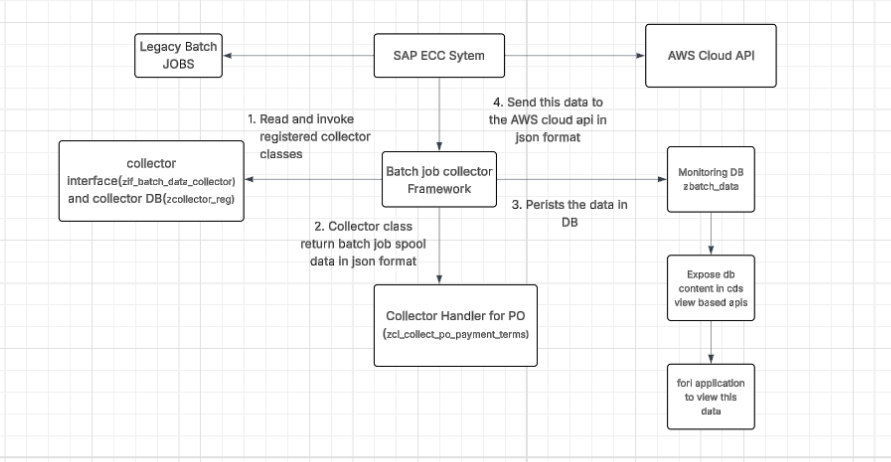

# LegoUseCase

## ✅ Assumptions

1. **Focus on Spool Output, Not Job Execution Metrics**  
   The framework is **intended to capture and transmit the output data generated by ECC batch jobs**, as found in their **spool**. It does **not** handle
   job execution-level KPIs or statistics, such as:
   - Job runtime duration
   - Job start/end timestamps
   - Job execution status (e.g., success, error)
   - Job step logs or exceptions
   - Resource usage (memory, CPU)
   - Job dependency or scheduling hierarchy

   These metrics can be handled via separate monitoring tools like SAP Solution Manager, SAP Job Monitoring.

3. **Collector Responsibility**  
   Each collector handler is responsible for:
   - Spool identification and reading logic
   - Transforming the unstructured text into structured JSON
   - Handling parsing edge cases for its respective batch job

4. **ZBATCH_DATA is a Generic Store**  
   The table `ZBATCH_DATA` is designed to store JSON from **multiple collectors with varying data models**, unified only by collector name and metadata.
   The consumers of this data (like CDS/Fiori/API) must parse and interpret the JSON dynamically.

---

## 📌 End-to-End Process Overview

1. **Fetch Collectors**  
   The custom framework reads a list of registered collector handlers from the table `ZCOLLECTOR_REG`.

2. **Invoke Collector Handlers**  
   Each collector represents a specific ECC batch job. The framework invokes the respective ABAP class to handle the job.

3. **Spool Data to JSON**  
   Each collector reads the spool output of its respective batch job, parses the data, and converts it to JSON format.

4. **Save to ZBATCH_DATA**  
   The framework saves the JSON payload and metadata (e.g., job name, execution time, record count, status) into the generic table `ZBATCH_DATA`.

5. **Send to AWS Cloud API**  
   The framework then invokes a separate method to push this JSON payload to a designated AWS Cloud API endpoint.

6. **Expose via Fiori**  
   A CDS View on top of `ZBATCH_DATA` is used to expose this data, which is visualized in a unified Fiori UI.

---

## 🏗️ Architecture Diagram

---
# Event-Driven Batch Collector Logging from SAP ECC to AWS

## 📘 Overview

To send batch job data entries from the SAP ECC system into an external system (e.g., AWS), using an event-driven approach. 

The ECC system writes to a custom table (`zbatch_data`), and based on this, a trigger logic posts the data to AWS either directly or through SAP Event Mesh.

---

## 🧱 Architecture Diagram
⚙️ Solution Options

✅ Option A: Direct REST Call to AWS from ECC

🔗 Flow
New entry is created in `zbatch_data`.

ABAP sends a POST request directly to the AWS REST API using CL_HTTP_CLIENT.

Approach 1: Asynchronous Execution with CALL FUNCTION ... STARTING NEW TASK

    Create a Remote-enabled Function Module. within the FM using cl_http_client trigger the call to AWS.
    Next call the FM 
    <pre> CALL FUNCTION 'Z_SEND_TO_AWS_ASYNC'
    STARTING NEW TASK 'AWS_SEND'
    DESTINATION 'NONE' </pre>
    
Approach 2 :

   Create a Remote-enabled Function Module. within the FM using cl_http_client trigger the call to AWS.
   Create bgRFC Destination.
   Call the FM via CALL FUNCTION IN BACKGROUND UNIT

   <pre> CALL FUNCTION 'Z_SEND_TO_AWS_BGRFC' IN BACKGROUND UNIT lv_unit
  DESTINATION INBOUND 'Z_AWS_LOGGING'
  EXPORTING
    iv_job_id     = lv_job_id
    iv_status     = lv_status
    iv_timestamp  = lv_timestamp
    iv_message    = lv_message. </pre>

Key Benefits of bgRFC over STARTING NEW TASK is the bgRFC has inbuilt retry mechanism.

✅ Option B: Use SAP Event Mesh for Messaging

🔗 Flow
Data is inserted in `zbatch_data`.

Trigger logic publishes a message to SAP Event Mesh.

AWS is subscribed to Event Mesh (using a webhookor or API Gateway).

AWS handles the message asynchronously.

🔧 Setup Requirements
SAP Event Mesh service on BTP

SAP ECC connected via SAP Cloud Connector

Queue/topic configured for messaging

Destination set up in BTP cockpit for ECC to publish

The Add-On SAP NetWeaver, add-on for event enablement (ASANWEE)

🔧 ABAP to Publish Event to Event Mesh
Use CL_HTTP_CLIENT to call Event Mesh REST API .
---

## ⚠️ Error Handling and Failure Points

| Stage                         | Potential Failure                             | Handling Strategy                                                   |
|------------------------------|-----------------------------------------------|---------------------------------------------------------------------|
| Fetching collectors          | Table empty, invalid/inactive collectors      | Skip invalid entries, log missing handlers                         |
| Calling handlers             | Missing class, unhandled exception            | Wrap in TRY-CATCH, update `status` and `message` in `ZBATCH_DATA`  |
| Spool reading & parsing      | Spool not found, empty/corrupt data           | Validate spool, handle edge cases, log errors                      |
| JSON conversion              | Malformed structure, large payload            | Catch conversion errors, truncate or split large JSON              |
| Saving to ZBATCH_DATA        | DB insert failure, key collision              | Use `INSERT OR UPDATE`, log SQL exceptions                         |
| Cloud API call               | Network issues, auth failure, 4xx/5xx response| Handle HTTP response, retry with backoff, update `status` field    |
| Fiori JSON visualization     | JSON structure varies, parse error on UI      | Validate JSON before saving, implement fallback UI behavior        |

---

## 🔧 Additional Recommendations

- Central logging using a utility class (e.g., `ZLOGGER`)
- Background job retry mechanism for failed collectors
- Notification via email or monitoring tools in case of repeated failures
- Unit testing for collector classes and JSON payloads

